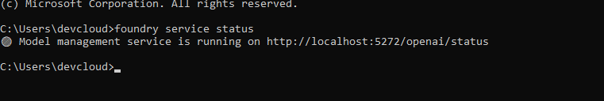
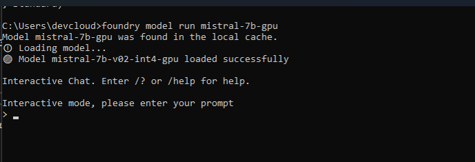
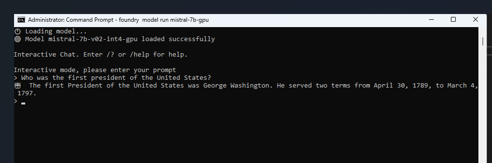
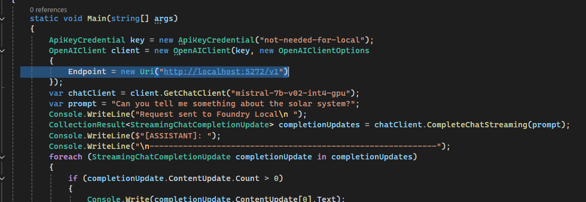
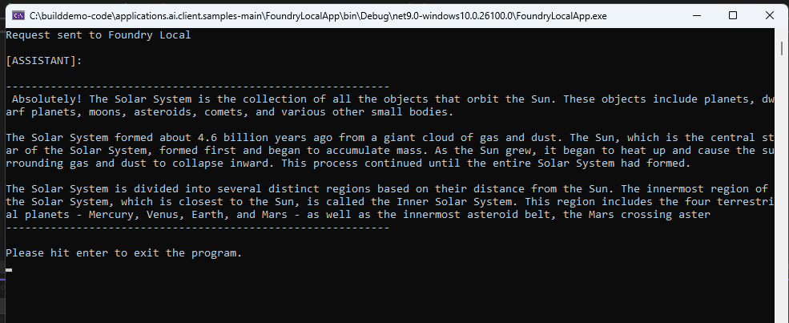

# Ready to Use Open Source Models Via Foundry Local

## Software Prerequisites

1. **Install Foundry Local:**  

   Follow the instructions at the link:  
   [Get Started with Foundry Local](https://learn.microsoft.com/en-us/azure/ai-foundry/foundry-local/get-started)

## Instructions for Running the Foundry Local Sample Application

1. **Load the Solution**  

   Open `FoundryLocalApp.sln` located in the `FoundryLocalApp` directory using Visual Studio.

2. **Build the Solution**  

   Run "Clean Solution" followed by "Build Solution".

3. **Run Foundry Local**  

   - Open the command prompt and check Foundry Local status by executing: `foundry service status`  
     You should see something like:  

     

   - Note the port number at which the Foundry service is running, which in this case is 5272.

   - Instruct Foundry Local to download and run `mistral-7b-gpu` by executing: `foundry model run mistral-7b-gpu`  

     

   - Run a test prompt to ensure the service is running.  

     
   
4. **Configure the Application**  

   In Visual Studio, open `Program.cs` and edit the endpoint to use the same port as where Foundry Local is running. The default is set to 5272.  

   

5. **Run the Project**  

   Execute the `FoundryLocalApp` project, and you should see a result similar to below.  

    