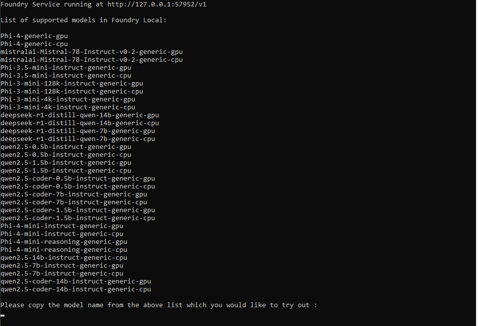
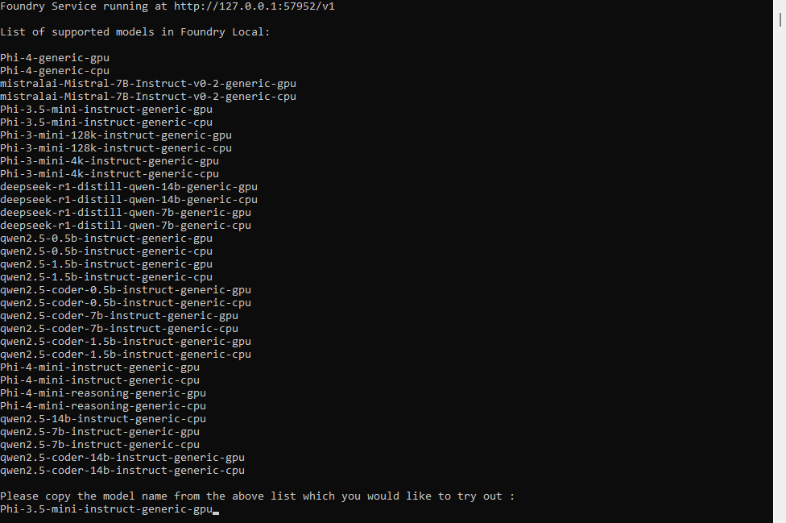
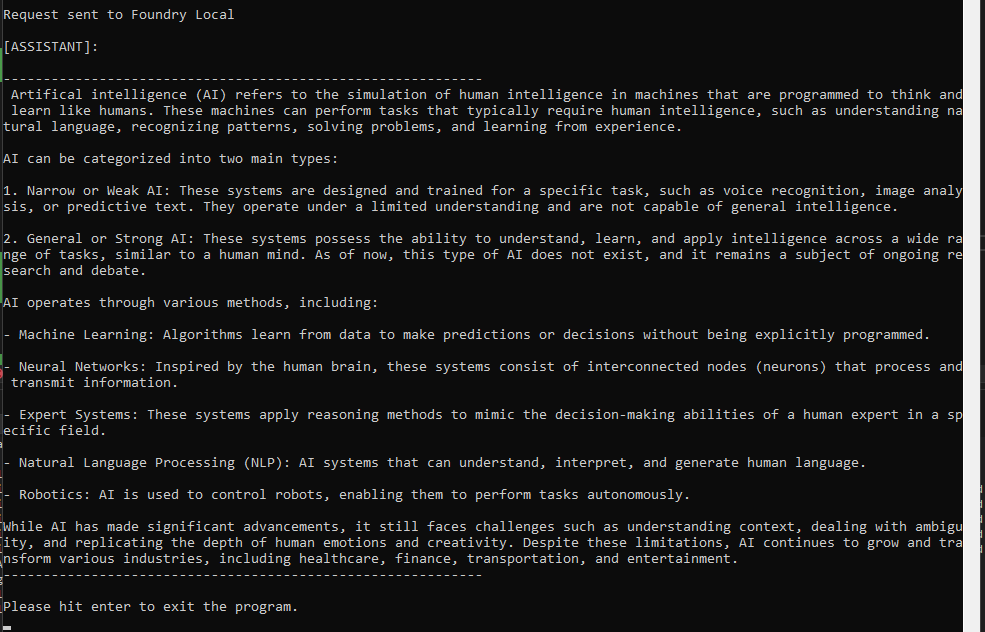

# Ready to Use Open Source Models Via Foundry Local

## Software Prerequisites

1. **Install Foundry Local:**  

   Follow the instructions at the link:  
   [Get Started with Foundry Local](https://learn.microsoft.com/en-us/azure/ai-foundry/foundry-local/get-started)

## Instructions for Running the Foundry Local Sample Application

1. **Load the Solution**  

   Open `FoundryLocalApp.sln` located in the `FoundryLocalApp` directory using Visual Studio. Please make sure to start Visual Studio as an administrator otherwise
   Foundry Local service may not start.

2. **Build the Solution**  

   Run "Clean Solution" followed by "Build Solution".

3. **Run the Project**  

   Execute the `FoundryLocalApp` project.
   
   The sample starts the Foundry Local Service and displays the list of models from which you can select the one you want to use for inferencing:

     

    Enter the name of the models from the list above. Please note that it can take several minutes for the model to download of not download previous based on the
    network speed and size of the model.

     

   Here is the result from the OpenAI call that is made to the selected model running in the Foundry Local Service :
   
      