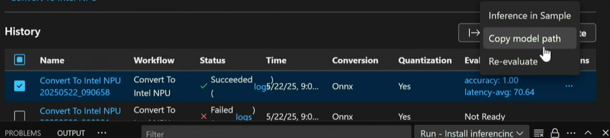

# Bring Your Own Model (BYOM)

## Software Prerequisites

1. **Install Visual Studio Code**  
   [Visual Studio Code](https://code.visualstudio.com/)

2. **Install AI Toolkit Extension in Visual Studio Code**  
   [AI Toolkit for VS Code](https://code.visualstudio.com/docs/intelligentapps/overview)

3. **Install Windows ML Runtime**  
   [Windows ML Runtime](https://learn.microsoft.com/en-us/windows/ai/new-windows-ml/distributing-your-app?tabs=csharp)
   
      Please note that Windows ML Runtime does not seem to be currently available through Winget. As an alternative, please follow the below steps until it becomes available through winget or the Windows ML Runtime documentation is updated:
     
    - From a windows powershell please go to the `WinML\Clip-VIT` folder. 
    - Run `dotnet add package Microsoft.Windows.AI.MachineLearning --version 0.3.131-beta`
    - From `C:\Users\<current windows user id>\.nuget\packages\microsoft.windows.ai.machinelearning\0.3.131-beta\tools\MSIX\win-x64` copy  `Microsoft.Windows. 
        AI.MachineLearning into a folder` say `c:\temp`
    - `cd c:\temp` and run the command `Add-AppxPackage .\Microsoft.Windows.AI.MachineLearning.msix`

    - This will install Windows ML Runtime and you can verify by going to the Installed Apps where you should see:
      

    
## Instructions for Running the Clip-VIT Sample

Running the sample involves the model preparation phase that converts and quantizes the model using AI Toolkit, followed by inferencing using Windows ML Runtime and Windows ML Runtime Intel OpenVINO EP.

### Model Preparation

1. **Set Up Huggingface Token**  
   - Set the Huggingface token as a system environment variable named `HUGGINGFACE_HUB_TOKEN`.
   - Create an access token if you don't have one by logging into your Hugging Face account. Follow these instructions:  
     [User Access Tokens](https://huggingface.co/docs/hub/en/security-tokens)

2. **Create New Model Project**  
   - Go to the AI Toolkit Extension and click on `Conversion (Preview)` > `New Model Project`.  

     

3. **Select Model**  
   - Choose the model `openai/clip-vit-vbase-patch32` and click the `Next` button.  

     

4. **Enter Project Details**  
   - Specify the folder name and project name, then click the `Next` button.  

     

5. **Select Conversion Workflow**  
   - Choose the "Convert to Intel NPU" workflow.  

     

6. **Run Conversion**  
   - Accept the default options for conversion to ONNX format and quantization, then hit the `Run` button.  

     

7. **Copy Model Path**  
   - Once conversion completes, copy the model path by going to `Actions` > `Copy Model Path`.  

     

8. **Access Model Files**  
   - Remove `model.onnx` from the end of the model path and enter the path in File Explorer.

9. **Copy Model Files**  
   - Copy files ending with extensions `openvino_model_quant_st.bin`, `openvino_model_quant_st.onnx`, and `openvino_model_quant_st.xml` into the root folder of the sample application, i.e., `Clip-VIT`.

### Model Inferencing

1. **Load the Solution**  
   Open `Clip-VIT.sln` located in the `Clip-VIT` directory.

2. **Build the Solution**  
   Run "Clean Solution" followed by "Build Solution".

3. **Prepare Image Directory**  
   Create a new folder named `images` under `C:\`, resulting in the path `C:\images`, and copy `bird.jpg` into it.

4. **Set Command Line Arguments**  
   - Right-click on `Clip-VIT` > `Properties` > `Debug` > `Command line arguments`.
   - Specify `c:\images\bird.jpg NPU` to target NPU as the execution device for the model.

   You can also target CPU and GPU as the execution devices with the following arguments:  
   - `c:\images\bird.jpg CPU`  
   - `c:\images\bird.jpg GPU`

5. **Run the Project**  
   Execute the `Clip-VIT` project, and you should see a result similar to below.  
   