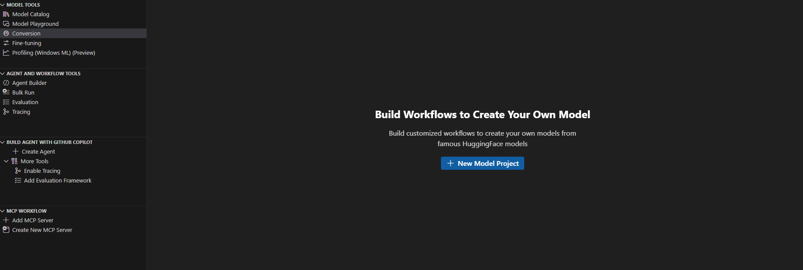
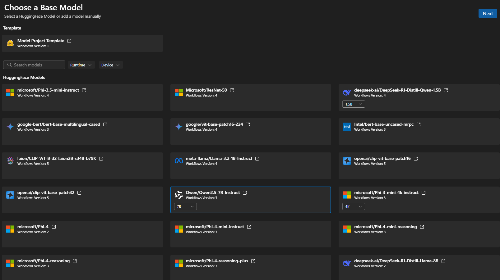
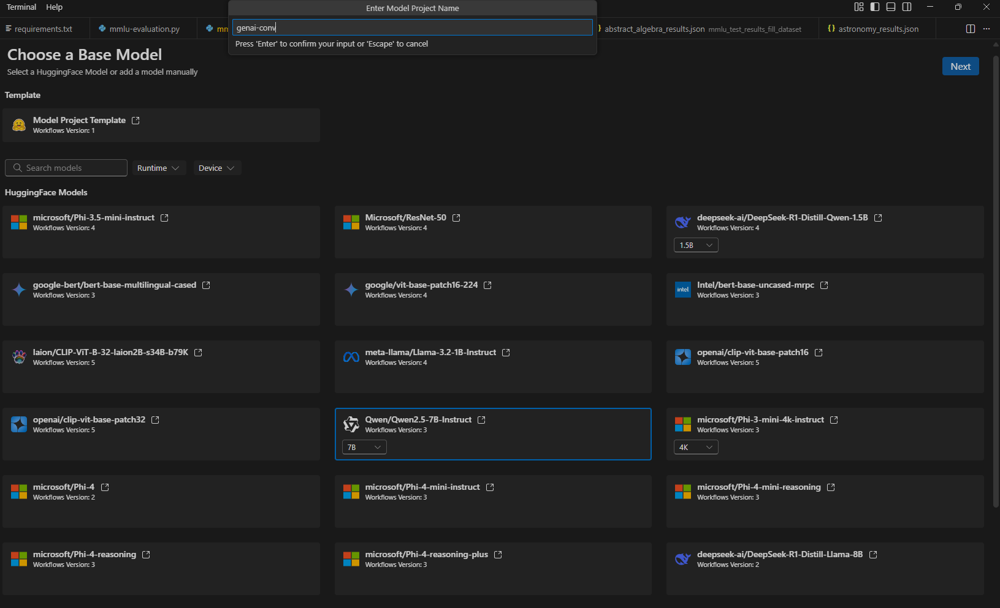
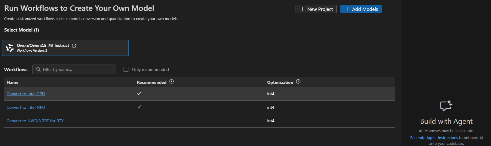
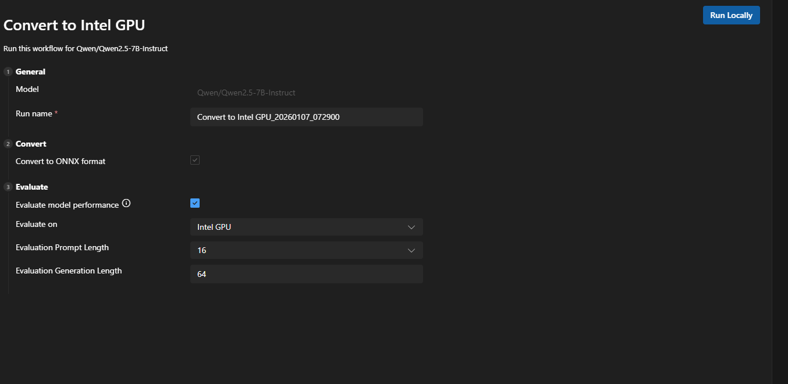
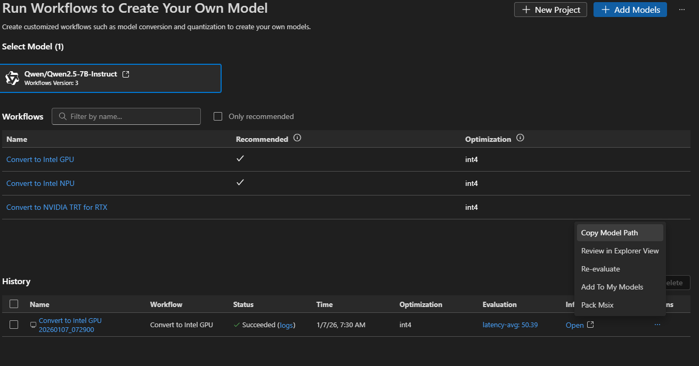
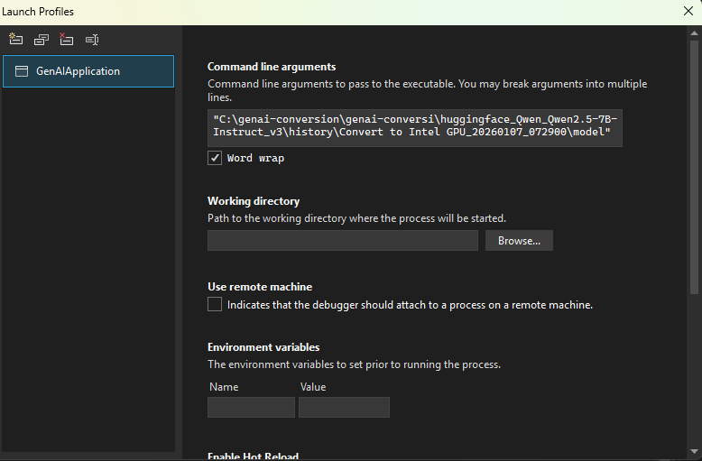
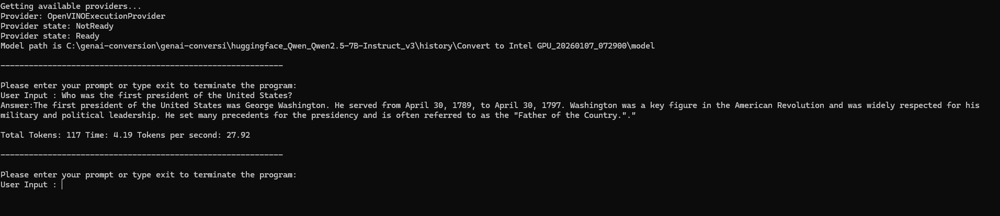

# Bring Your Own Model (BYOM)

## Software Prerequisites

1. **Install Visual Studio Code**  
   [Visual Studio Code](https://code.visualstudio.com/)

2. **Install AI Toolkit Extension in Visual Studio Code**  
   [AI Toolkit for VS Code](https://code.visualstudio.com/docs/intelligentapps/overview)

3. **Install latest Windows App SDK Stable Release**
   [Windows App SDK](https://learn.microsoft.com/en-us/windows/apps/windows-app-sdk/downloads)   
  
    
## Instructions for Running the Qwen2.5-7B-Instruct Sample

Running the sample involves the model preparation phase that converts and quantizes the model using the AI Toolkit, followed by inferencing using Windows ML Runtime and Windows ML Runtime Intel OpenVINO EP.

### Model Preparation

1. **Set Up Huggingface Token**  
   - Create a hugging face account if you don't have one by going to [Hugging Face](https://huggingface.co)
   - Create an access token if you don't have one by logging into your Hugging Face account. Follow these instructions:  
     [User Access Tokens](https://huggingface.co/docs/hub/en/security-tokens)
   - Set the Huggingface token as a system environment variable named `HUGGINGFACE_HUB_TOKEN`.

2. **Create New Model Project**  
   - Go to the AI Toolkit Extension and click on `Conversion` > `New Project`.  

     

3. **Select Model**  
   - Choose the model `Qwen/Qwen2.5-7B-Instruct` and click the `Next` button.  

     

4. **Enter Project Details**  
   - Specify the folder name and project name, then click the `Next` button.  

     

5. **Go back to AI Toolkit Extension**  
   - Go to the AI Toolkit Extension and click on `Conversion > Select Model`

     

6. **Select Conversion Workflow**  
   - Click on "Convert to Intel GPU" workflow.  

     

7. **Run Conversion**  
   - Accept the default options for conversion to ONNX format and quantization, then hit the `Run` button.  

     

8. **Copy Model Path**  
   - Once conversion completes, copy the model path by going to `Actions` > `Copy Model Path`.  

     

### Model Inferencing

1. **Load the Solution**  
   Open `GenAIApplication.sln` located in the `GenAIApplication` directory.

2. **Build the Solution**  
   Run "Clean Solution" followed by "Build Solution".

3. **Set Command Line Arguments**  
   - Right-click on `GenAIApplication` > `Properties` > `Debug` > `Command line arguments`.
   - Specify the complete path for the model assets that were generated during the model preparation phase. For example :  
     `C:\genai-conversion\genai-conversi\huggingface_Qwen_Qwen2.5-7B-Instruct_v3\history\Convert to Intel GPU_20260107_072900\model`

     

4. **Run the Project**  
   Execute the `GenAIApplication` project, and you should see a result similar to below upon entering the prompt.  
   