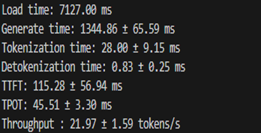

# Cloud to Client Migration Recipe: Machine Learning Workload

This guide provides a comprehensive overview of migrating a machine learning workload from a cloud environment to client-side deployment. It focuses on leveraging local computational resources, including CPUs, GPUs, and NPUs, to optimize performance and efficiency. The language translation functionality serves as the primary use case to illustrate the migration workflow.

## Migration Flow Overview

The migration journey is depicted in the diagram above, illustrating the transition from a cloud-based machine learning workload to a client-side setup:

- **Initial Setup (Cloud):** The machine learning workload is initially hosted in the cloud, integrated with ISV/Enterprise applications running on PCs. This setup allows for centralized processing and management of ML tasks.
  
- **Client-Side Deployment:** The workload is migrated to user devices (PCs), where it operates locally, utilizing the computational capabilities of CPUs, GPUs, and NPUs. This transition aims to reduce cost, latency, provide privacy and enable offline functionality.

## Key Considerations

### 1. Code Migration
- **Framework Transition:** Evaluate the potential need to migrate code to a new machine learning framework such as OpenVINO that is better suited for client-side deployment.

### 2. Performance and Resource Utilization
- **Task Manager Utilization:** Use Task Manager to monitor resource utilization on client devices. This helps determine whether the workload is compute-bound or memory-bound, guiding optimization efforts.
- **Inbuilt Performance Metrics:** Leverage performance metrics integrated into the OpenVINO (OV) framework to assess and optimize the workload's efficiency on client devices.

### 3. Accuracy Metrics
- **Model-Specific Metrics:** Accuracy metrics vary based on the model type and use case. For language translation scenarios, the METEOR score is a suitable metric to evaluate translation quality and accuracy.

As shown below in the flow diagram please optimize the model and application until the target key performance indicators(KPI's) are achieved.

## Use Case: Language Translation

The migration process is particularly relevant for language translation applications, where real-time processing and offline capabilities are crucial. By deploying the translation models on client devices, users can experience faster translations and improved accessibility, even without constant internet connectivity. Please note that the translation use case was chose for its simplicitly in demonstrating the considerations for the migration however the optimized model in this case a Large Language Model(LLM) can support several other use cases such as Q&A, summarization etc.

## Software Prerequisites

1. **Install Visual Studio Code**  
   [Visual Studio Code](https://code.visualstudio.com/)

2. **Install Python**  
   [Python ](https://www.python.org/)

    
## Instructions for Running the Cloud to Client Migration Sample.

Running the sample involves the model preparation phase that converts and quantizes the model using Optimum Intel, followed by inferencing using OpenVINO on the different target devices such as CPU, GPU and NPU.

### Model Preparation

1. **Set Up Huggingface Token**  
   - Create a hugging face account if you don't have one by going to [Hugging Face](https://huggingface.co)
   - Create an access token if you don't have one by logging into your Hugging Face account. Follow these instructions:  
     [User Access Tokens](https://huggingface.co/docs/hub/en/security-tokens)
   - Set the Huggingface token as a system environment variable named `HUGGINGFACE_HUB_TOKEN`.
 
2. **Model Access on Huggingface**  
   - We will be using `meta-llama/Llama-3.1-8B-Instruct` for the sample. You will need to request access to this gated model by visiting: [Llama-3.1-8B-Instruct](https://huggingface.co/  
     meta-llama/Llama-3.1-8B-Instruct).
   - Additionally, please refer to the model card and license information at : [Llama-3.1-8B-Instruct](https://huggingface.co/meta-llama/Llama-3.1-8B-Instruct).
     
     *Please note that microsoft/Phi-3.5-mini-instruct can be used as an alternate model in case you would like to use something that is publicly available. Please replace the model as microsoft/Phi-3.5-mini-instruct in the below commands if you choose to go that route.*

3. **Create Python Virtual environment for model preparation and inferencing**  
   - Navigate to the `cloudtoclientmigration` folder where the migration assets are located.  
   - Create a python virtual environment by running the command:`python -m venv cloudtoclient-venv`
   - Activate the virtual environment by running the command: `.\cloudtoclient-venv\Scripts\activate`
   - Install the python dependencies by running the command: `pip install -r requirements.txt`

4. **Model Conversion and Optimization**
   - Login to Huggingface by running the command: `huggingface-cli login --token %HUGGINGFACE_HUB_TOKEN%`
   - Convert the `Llama-3.1-8B-Instruct` model into an OpenVINO intermediate representation and quantize it to INT8 datatype by running:
     `optimum-cli export openvino --model meta-llama/Llama-3.1-8B-Instruct  --weight-format int8 --trust-remote-code .\quantized-model\llama-3.1\int8`
   - Similarly, convert the model to INT4 datatype by running: 
     `optimum-cli export openvino --model meta-llama/Llama-3.1-8B-Instruct  --weight-format int4 --trust-remote-code .\quantized-model\llama-3.1\int4`
   - You should see the quantized models generated in the `quantized-model` directory.

   *Please note that the model conversion commands used above are located in the `model-preparation\commands.txt` file.*

### Model Inferencing

1. **Preparing for Inferencing**
 - Open the task manager to examine the memory usage and the CPU/GPU/NPU activity depending on the target device. The default target device is GPU for this sample which can be changed using the command line parameter -d for example appending `-d CPU` to the inferencing commands.

   **Please note that the metrics generated during inferencing depend on the specific model and configuration of the PC and are only meant to illustrate the migration process.**

2. **Run Inferencing on INT8 quantized model**
   - Navigate to the inferencing directory: `cd inferencing`
   - Execute the inferencing script `python llm-inferencing.py -m ..\quantized-models\llama-3.1\int8 -pf prompts.jsonl`
   - The original text, including the reference translated text, is located in the `prompts.jsonl` file.
   - The `llm-inferencing.py` script performs inferencing on the model located at `..\quantized-models\llama-3.1\int8` and stores the translated text along with the original prompt and  
     reference text in the results folder, which in this case is `..\results\llama-3.1\int8\results.json`. The `results.json` file will later be used for calculating the accuracy metric for language translation called the METEOR score.
   - Examine Task Manager activity during inferencing; you should see activity similar to the following:

   - GPU Usage for INT8 

     

   - Memory Usage before inferencing
     
     

   - Memory Usage during inferencing
     
     
     
  

3. **Performance Metrics for the INT8 quantized model**

   - The translated text is output to the command prompt as inferencing takes place, and performance metrics are displayed at the end, similar to the screenshot below.
    
     
4. **Run Inferencing on INT4 quantized model**  
   - To compare resource usage, performance metrics, accuracy metrics please run the int4 quantized model that was generated in the model preparation phase and located at: 
     quantized-models\llama-3.1\int4
   - Execute the inferencing script `python llm-inferencing.py -m ..\quantized-models\llama-3.1\int4 -pf prompts.jsonl`
   - The `llm-inferencing.py` script performs inferencing on the model located at `..\quantized-models\llama-3.1\int4` and stores the translated text along with the original prompt and 
     reference text in the results folder, which in this case is `..\results\llama-3.1\int4\results.json`. This `results.json` file will later be used for calculating the accuracy metric for language translation called the METEOR score.
   - Examine Task Manager activity during inferencing; you should see activity similar to the following:

   - GPU Usage for INT4

     
   
   - Memory Usage before inferencing

     

   - Memory Usage during inferencing

     

   - You will notice that GPU utilization and memory usage for INT4 are lower compared to INT8.

5. **Performance Metrics for the INT4 quantized model**

   - The translated text is output to the command prompt as inferencing takes place, and performance metrics are displayed at the end, similar to the screenshot below.

      

6. **Calculate Accuracy Metrics**
   - Navigate to the accuracy directory: cd ..\accuracy
   - Download tokenization and WordNet resources: `python downloadnltkresources.py`
   - Calculate the accuracy metric - METEOR score for INT8: `python accuracymetric.py -r ..\results\llama-3.1\int8\results.json`
     You should see a score similar to the screenshot below.

     

   - Calculate the accuracy metric - METEOR score for INT4: `python accuracymetric.py -r ..\results\llama-3.1\int4\results.json`
     You should see a score similar to the screenshot below.

     

   - You will notice that the METEOR score for INT8 is higher than INT4, as there can be a drop in accuracy when model precision is reduced.
   
7. **Conclusion**  
   - The above sample demonstrates key considerations — resource utilization, performance, and accuracy metrics — when migrating a workload from cloud to client. During the development phase, these factors need to be taken into account when making decisions around model optimization and target devices.